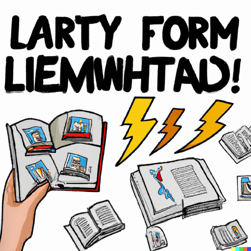

## Vorbereitung

Ich **empfehle dringend**, dass du die folgenden Dinge tust. Dennoch gehe ich
davon aus, dass einige Leute sie vielleicht nicht erledigt haben, und ich werde
Zeit und Anweisungen geben, um sie während des Treffens durchzuführen. Also,
selbst wenn du keine Zeit zum Vorbereiten hast, komm trotzdem! Warum solltest
du es vorher erledigen? Weil es einen Unterschied macht, ob 20% der Leute
während der Live-Einrichtung Hilfe benötigen oder 100%.

* Bringe ein **elektronisches Gerät** zur Veranstaltung mit, entweder ein
  Laptop, ein Android-Handy/-Tablet oder ein iPhone/iPad. Wenn du kein Gerät
  hast, kannst du anhand von Karteikarten teilnehmen, die ich bereitstellen
  werde, oder mit jemandem zusammenarbeiten, der ein elektronisches Gerät hat.
* **Installiere Anki** (Windows/Linux/macOS/Android/iOS) auf dem Gerät, das du
  mitbringst: https://apps.ankiweb.net/#download (Beachte, dass die iOS-App für
  iPhone/iPad $25 kostet - eine lohnenswerte Ausgabe, aber alles andere ist
  kostenlos).
* Falls du Anki schon installiert hast, **aktualisiere** bitte auf die neueste
  Version (Für PC 23.10.1, AnkiDroid für Android 2.16.5, AnkiMobile für iOS
  23.10)
* **Registriere dich** bei AnkiWeb (kostenlos):
  https://ankiweb.net/account/signup

**Optional** zusätzliche Vorbereitung:

* Lies über einige Schlüsselkonzepte:
  http://www.dennisproksch.de/anki#die-grundlagen
* Lies was Flo zu dem Thema geschrieben hat:
  https://www.kreativrauschen.de/blog/2022/05/20/anki-spaced-repetition-gedaechtnis-wundermittel/
* [Englisch] Sehr gründlicher Artikel über _spaced repetition_, einschließlich
  Daten und Forschung: https://gwern.net/spaced-repetition
* [Englisch] Michael Nielsen (ein berühmter Quantenphysiker und Informatiker)
  erklärt, wie er Anki verwendet (zum Beispiel, um Forschungsarbeiten zu lesen)
  und gibt Hintergrundinformationen. Dieser Artikel hat mich wahrscheinlich vor
  einigen Jahren dazu motiviert, mit Anki zu beginnen.
  https://augmentingcognition.com/ltm.html

## Was werden wir tun?

Ich habe Anki seit 1279 Tagen täglich verwendet (ok, ich habe insgesamt etwa 10
Tage verpasst). Das sind 3 Jahre und 6 Monate. Es war eine der bedeutendsten
Verbesserungen in meinem Leben.

Ich werde erklären, was das Konzept der _spaced repetition_ ist, wie es
funktioniert und wie du es nutzen kannst, um dich an alles zu erinnern, was du
für so lange wie du möchtest merken möchtest. Das Auswendiglernen hat einen
schlechten Ruf, aber tatsächlich nutzen all deine Gedanken und kreativen
Einsichten Erinnerungen, die in deinem Gehirn gespeichert sind. Ein Buch zu
lesen und sich Jahre später an die Kernideen erinnern zu können, ist wertvoll.
Begriffe mit Namen verknüpfen ist wertvoll. Ich werde viele konkrete Beispiele
dafür zeigen, wie und warum ich Anki verwende, auf welche Schwierigkeiten ich
gestoßen bin und welche Lehren ich gezogen habe.

Zu guter Letzt werde ich euch bei der Verwendung von Anki während des Treffens
anleiten. Ihr werdet es auf eurem Gerät installieren (wenn möglich, tut dies
bitte vor dem Treffen, siehe den Abschnitt "Vorbereitung" oben). Dann werdet
ihr einen Text nehmen und ihn in gute Anki-Karten umwandeln. Anki-Karten zu
erstellen ist einfach. Gute Karten zu erstellen, ist schwer. Euer Erfolg wird
davon abhängen, Anki zur Gewohnheit zu machen und großartige Karten zu haben.

Wofür könnt ihr Anki verwenden? Zum Lernen jedes Fachs (Schule, Universität,
privat). Zum Zusammenfassen von Büchern, Artikeln oder Forschungsarbeiten. Zum
Testen kleiner Aufgaben. Hier sind einige Beispiele aus meiner Sammlung:

* Namen von Personen anhand ihrer Fotografien
* Nahrungsmittelallergien, Namen der Kinder und Ehepartner von Freunden
* Kleine mathematische Aufgaben (z.B. was ist die Ableitung von f(x) =
  (3-6x)^5? Es werden zwei Karten vom gut gemischten Deck gezogen. Was ist die
  Wahrscheinlichkeit, dass die erste Karte die Kreuzsieben und die zweite Karte
  die Herzdame ist?)
* Wichtige Telefonnummern
* Vokabeln und Ausdrücke in verschiedenen Sprachen
* Grammatikregeln (z.B. zuende oder zu Ende?)
* Richtiges Schreiben von Wörtern (z.B. warnehmen/wahrnehmen,
  misverständlich/missverständlich)
* Bedeutung von Wörtern/Ausdrücken (z.B. Warten auf Godot, Klampfe)
* Zutaten für Lieblingsrezepte
* Tastenkürzel am Computer (z.B. wie man das ausgewählte, aber versteckte Objekt in Inkscape zieht)
* Erkennen von Tonarten, Intervallen und Noten in Notenblättern
* Grundideen aus Büchern (z.B. aus Dale Carnegies "Wie man Freunde gewinnt":
  Achte darauf, die Namen der Leute [...])
* ...

## Organisatorisches

Du hast Angst nichts beitragen zu können? Keine Sorge! Jede/r ist willkommen!

Es gibt immer eine Mischung aus deutsch- und englischsprachigen
Teilnehmer:innen, und wir gestalten die Diskussionsrunden so, dass sich alle
wohl fühlen und teilnehmen können. Die Hauptsprache ist Englisch.

Der heutige Gastgeber ist Omar.

Es wird Snacks und Getränke geben.

Nach dem Meetup gehen wir Essen. Jede/r der/die Zeit hat ist herzlich
eingeladen mitzukommen.

## Sonstiges

[Erfahre mehr über uns]().

<small>Bild mit der _DALL·E_ generiert.</small>
