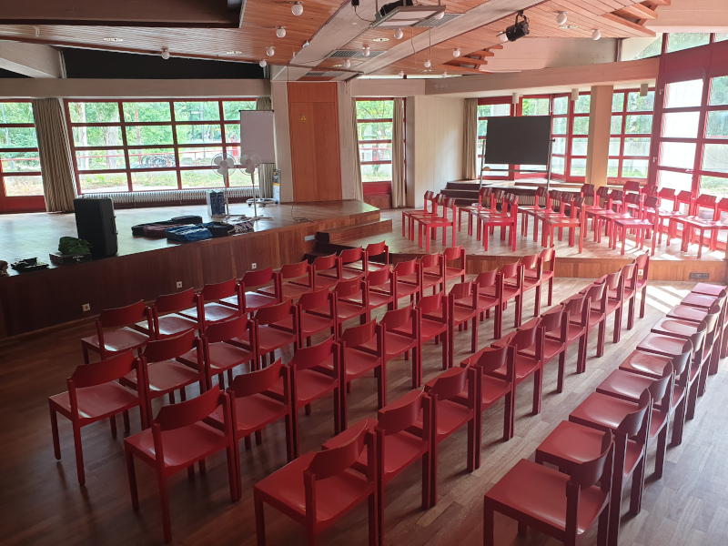

"Who wants to brag about something they did last week?"

That was the question posed to the entire circle of people sitting in a park in
the center of Berlin. And then one by one people started bragging and everyone
else cheered them on.

<!--more-->

Strictly speaking this happened after the LessWrong Community Weekend during
the _Rationality Dojo_ that the Berlin Community organized, but it is an
illustrative example of the unusual nature of this event.

If you were to look at the table of talks you would see: dancing, meditation,
how to make fire in the wilderness, kissing workshop, acapella singing, early
morning running, dealing with depression and anxiety, modular origami workshop,
Japanese Mahjong, neurobiology of psychedelics, crochet 101, dark arts intro to
rhetoric, ...

Hardly what one commonly thinks of as _rationality_, is it? Well in that case
you would also see multiple talks and workshops about AI (artificial
intelligence) safety, meetup organization, wisdom, probability theory and Fermi
estimates or practical exercises such as "Circling", "Hamming circles", "Double
Crux" and "Gendlin's Focusing".

What is more, all of it was organized as an _unconference_, meaning that anyone
could add a new event to the schedule at any time or just change their mind and
move it to a different slot.

Let's not forget about Duncan Sabien's (former CFAR - Center for Applied
Rationality - instructor and author of the [CFAR
handbook](https://www.rationality.org/files/CFAR_Handbook_2021-01.pdf)) keynote
speech ["The moments that matter"](https://youtu.be/7WUEnh2TFSk), which had to
be delivered via video due to COVID. His key message, that the tools of
Rationality should actually be put into practice instead of theorizing,
especially in the moments where it's hardest, really resonanted with many
participants. Does making the right choices most of the time count for nothing?
It does count, but if in the really crucial moments, the _moments that matter_
you keep making the wrong decisions, what is the difference?

Around 150 people from all over the world, though mostly Europe, showed up and
the entire vibe was inspiring, beautiful and touching. So many fascinating
conversations in the hallways, during lunch or on the way to one of the evening
swims in the lake Wannsee.

Not a single moment of boredom could be another way of putting it. Everyone was
open and welcoming, bringing their own incredible experiences and knowledge to
the table, keeping the minds and hearts of the rest engaged.

Participants were staying in the same hostel, almost entirely booked for us, right
next to the lake, with plenty of food, Mate tea, snacks and board games.

Last but not least, just in case you are wondering about COVID protocol:
Everyone was required to test themselves with the highest quality available
antigen test, provided by the organizers, upon arrival and then every morning
before leaving their room. One of many ways in which the wonderful organizers
worked tirelessly to make the event fantastic for everyone.

Thank you, from the bottom of my heart to every single attendee and organizer!
See you next time!

If you are in or around Freiburg come to the meetups in the next months to
learn much more about the exercises and experiences of this awesome weekend!

